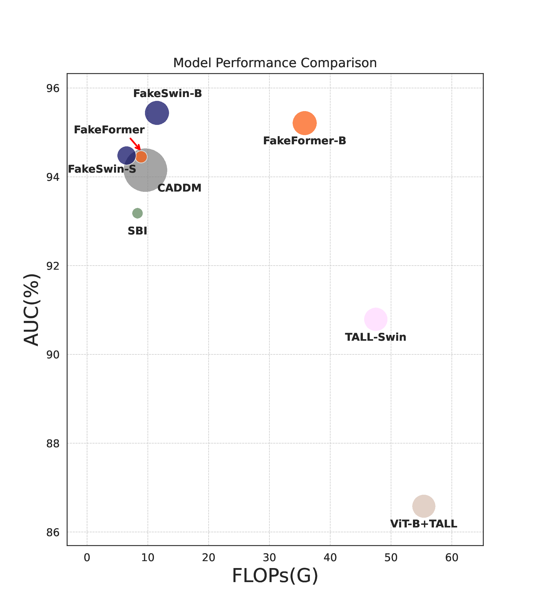

# FakeFormer: Efficient Vulnerability-Driven Transformers for Generalisable Deepfake Detection

This is an official implementation for FakeFormer! [[📜Paper](https://arxiv.org/abs/2410.21964)]


<!--  -->


Contact: dat.nguyen@uni.lu. Any questions or discusses are welcomed!


## Updates
- [ ] -/-/2026: *Code refactor 🚀.*
- [ ] -/-/2026: *An update version with more results on more challenging datasets 🌟.*
- [x] 27/11/2025: *Release official code and pretrained weights 🌈.*
- [x] 06/09/2024: *First version pre-released for this open source code 🌱.*


## Abstract
Recently, Vision Transformers (ViTs) have achieved unprecedented effectiveness in the general domain of image classification. Nonetheless, these models remain underexplored in the field of deepfake detection, given their lower performance as compared to Convolution Neural Networks (CNNs) in that specific context. In this paper, we start by investigating why plain ViT architectures exhibit a suboptimal performance when dealing with the detection of facial forgeries. Our analysis reveals that, as compared to CNNs, ViT struggles to model localized forgery artifacts that typically characterize deepfakes. Based on this observation, we propose a deepfake detection framework called FakeFormer, which extends ViTs to enforce the extraction of subtle inconsistency-prone information. For that purpose, an explicit attention learning guided by artifact-vulnerable patches and tailored to ViTs is introduced. Extensive experiments are conducted on diverse well-known datasets, including FF++, Celeb-DF, WildDeepfake, DFD, DFDCP, and DFDC. The results show that FakeFormer outperforms the state-of-the-art in terms of generalization and computational cost, without the need for large-scale training datasets.


## Main Results
Results on 6 datasets ([CDF1, CDF2](https://github.com/yuezunli/celeb-deepfakeforensics), [DFW](https://github.com/deepfakeinthewild/deepfake-in-the-wild), [DFD](https://blog.research.google/2019/09/contributing-data-to-deepfake-detection.html), [DFDC, DFDCP](https://ai.meta.com/datasets/dfdc/)) under cross-dataset evaluation setting reported by AP and AUC.

| CDF1 |  CDF2  |    DFW     |     DFD    |     DFDC   |   DFDCP |
|------|--------|------------|------------|------------|---------|
|<table><thead><tr><th>AUC</th><th>AP</th></tr></thead><tbody><tr><td>97.25</td><td>98.36</td></tr></tbody></table>|<table><thead><tr><th>AUC</th><th>AP</th></tr></thead><tbody><tr><td>94.45</td><td>97.15</td></tr></tbody></table>|<table><thead><tr><th>AUC</th><th>AP</th></tr></thead><tbody><tr><td>81.74</td><td>83.72</td></tr></tbody></table>|<table><thead><tr><th>AUC</th><th>AP</th></tr></thead><tbody><tr><td>96.12</td><td>98.31</td></tr></tbody></table>|<table><thead><tr><th>AUC</th><th>AP</th></tr></thead><tbody><tr><td>78.91</td><td>80.01</td></tr></tbody></table>|<table><thead><tr><th>AUC</th><th>AP</th></tr></thead><tbody><tr><td>96.30</td><td>99.50</td></tr></tbody></table>|


## Recommended Environment
*For experiment purposes, we encourage the installment of the following libraries. Both Conda or Python virtual env should work.*

* CUDA: 11.4
* [Python](https://www.python.org/): >= 3.8.x
* [PyTorch](https://pytorch.org/get-started/previous-versions/): 1.8.0
* [TensorboardX](https://github.com/lanpa/tensorboardX): 2.5.1
* [ImgAug](https://github.com/aleju/imgaug): 0.4.0
* [Scikit-image](https://scikit-image.org/): 0.17.2
* [Torchvision](https://pytorch.org/vision/stable/index.html): 0.9.0
* [Albumentations](https://albumentations.ai/): 1.1.0
* [mmcv](https://github.com/open-mmlab/mmcv): 1.6.1


## Pre-trained Models
* 📌 *The pre-trained weights of FakeFormer and FakeSwin can be found [here](https://huggingface.co/10Ring/FakeFormer/tree/main)*


## Docker Build (Optional)
*We further provide an optional Docker file that can be used to build a working env with Docker. More detailed steps can be found [here](dockerfiles/README.md).*

1.  Install docker to the system (skip the step if docker has already been installed):
    ```shell
    sudo apt install docker
    ```
2. To start your docker environment, please go to the folder **dockerfiles**:
   ```shell
   cd dockerfiles
   ```
3. Create a docker image (you can put any name you want):
    ```shell
    docker build --tag 'fakeformer' .
    ```


## Quickstart
1. **Preparation**

    1. ***Prepare environment***

        Installing main packages as the recommended environment. *Note that we recommend building mmcv from source as below.*
        > git clone https://github.com/open-mmlab/mmcv.git \
        cd mmcv \
        git checkout v1.6.1 \
        MMCV_WITH_OPS=1 pip install -e .
    
    2. ***Prepare dataset***
        
        1. Downloading [FF++](https://github.com/ondyari/FaceForensics) *Original* dataset for training data preparation. Following the original split convention, it is firstly used to randomly extract frames and facial crops:
            ```
            python package_utils/images_crop.py -d {dataset} \
            -c {compression} \
            -n {num_frames} \
            -t {task}
            ```
            (*This script can also be utilized for cropping faces in other datasets such as [CDF1, CDF2](https://github.com/yuezunli/celeb-deepfakeforensics), [DFD](https://blog.research.google/2019/09/contributing-data-to-deepfake-detection.html), [DFDCP, DFDC](https://ai.meta.com/datasets/dfdc/) for cross-evaluation test. You do not need to run crop for [DFW](https://github.com/deepfakeinthewild/deepfake-in-the-wild) as the data is already preprocessed*).
            
            | Parameter | Value | Definition  |
            | --- | --- | --- |
            | -d | Subfolder in each dataset. For example: *['Face2Face','Deepfakes','FaceSwap','NeuralTextures', ...]*| You can use one of those datasets.|
            | -c | *['raw','c23','c40']*| You can use one of those compressions|
            | -n | *128*  | Number of frames (*default* 32 for val/test and 128 for train) |
            | -t | *['train', 'val', 'test']* | Default train|
            
            These faces cropped are saved for online pseudo-fake generation in the training process, following the data structure below:
            
            ```
            ROOT = '/data/deepfake_cluster/datasets_df'
            └── Celeb-DFv2
                └──...
            └── FF++
                └── c0
                    ├── test
                    │   └── frames
                    │       └── Deepfakes
                    |           ├── 000_003
                    |           ├── 044_945
                    |           ├── 138_142
                    |           ├── ...
                    │       ├── Face2Face
                    │       ├── FaceSwap
                    │       ├── NeuralTextures
                    │       └── original
                    |   └── videos
                    ├── train
                    │   └── frames
                    │       └── aligned
                    |           ├── 001
                    |           ├── 002
                    |           ├── ...  
                    │       └── original
                    |           ├── 001
                    |           ├── 002
                    |           ├── ...
                    |   └── videos
                    └── val
                        └── frames
                            ├── aligned
                            └── original
                        └── videos
            ```
        
        2. Downloading **Dlib** [[68]](https://github.com/davisking/dlib-models) [[81]](https://github.com/codeniko/shape_predictor_81_face_landmarks) facial landmarks detector pretrained and place into ```/pretrained/```. whereas the *68* and *81* will be used for the *BI* and *SBI* synthesis, respectively.

        3. Landmarks detection and alignment. At the same time, a folder for aligned images (```aligned```) is automatically created with the same directory tree as the original one. After completing the following script running, a file that stores metadata information of the data is saved at ```processed_data/c0/{SPLIT}_<n_landmarks>_FF++_processed.json```.
            ```
            python package_utils/geo_landmarks_extraction.py \
            --config configs/data_preprocessing_c0.yaml \
            --extract_landmarks \
            --save_aligned
            ```
        4. (Optional) Finally, if using BI synthesis, for the online pseudo-fake generation scheme, 30 similar landmarks are searched for each facial query image beforehand.
            ```
            python package_utils/bi_online_generation.py \
            -t search_similar_lms \
            -f processed_data/c0/{SPLIT}_68_FF++_processed.json 
            ```
            
            *The final annotation file for training is created as* ```processed_data/c0/dynamic_{SPLIT}BI_FF.json```
        
2. **Training script**

    We offer a number of config files for specific data synthesis. For *FakeFormer* with *BI*, open ```configs/spatial/vit_bi_small.yaml```, please make sure you set ```TRAIN: True``` and ```FROM_FILE: True``` and run:
    ```
    ./scripts/vit_bi.sh
    ```

    Otherwise, with *SBI*, with the config file ```configs/spatial/vit_sbi_small.yaml```:
    ```
    ./scripts/vit_sbi.sh
    ```
    You can also find other configs for *FakeSwin* in the ```configs/``` folder. 


3. **Testing script**

    For *FakeFormer* with *BI*, open ```configs/spatial/vit_bi_small.yaml```, with ```subtask: eval``` in the *test* section, we support evaluation mode, please turn off ```TRAIN: False``` and ```FROM_FILE: False``` and run:
    ```
    ./scripts/test_bi.sh
    ```
    Otherwise, for *SBI*
    ```
    ./scripts/test_sbi.sh
    ```
    > ⚠️ *Please make sure you set the correct path to your download pre-trained weights in the config files.*

    > ℹ️ *Flip test can be used by setting ```flip_test: True```*
    
    > ℹ️ *The mode for single image inference is also provided, please set ```sub_task: test_image``` and pass an image path as an argument in test.py*


## Contact
Please contact dat.nguyen@uni.lu. Any questions or discussions are welcomed!


## License
This software is © University of Luxembourg and is licensed under the snt academic license. See [LICENSE](LICENSE)


## Acknowledge
We acknowledge the excellent implementation from [OpenMMLab](https://github.com/open-mmlab) ([mmengine](https://github.com/open-mmlab/mmengine), [mmcv](https://github.com/open-mmlab/mmcv)), [BI](https://github.com/AlgoHunt/Face-Xray), [SBI](https://github.com/mapooon/SelfBlendedImages), and [LAA-Net](https://github.com/10Ring/LAA-Net).


## Citation
Please kindly consider citing our papers in your publications.
```
@article{nguyen2024fakeformer,
  title={Fakeformer: Efficient vulnerability-driven transformers for generalisable deepfake detection},
  author={Nguyen, Dat and Astrid, Marcella and Ghorbel, Enjie and Aouada, Djamila},
  journal={arXiv preprint arXiv:2410.21964},
  year={2024}
}
```
